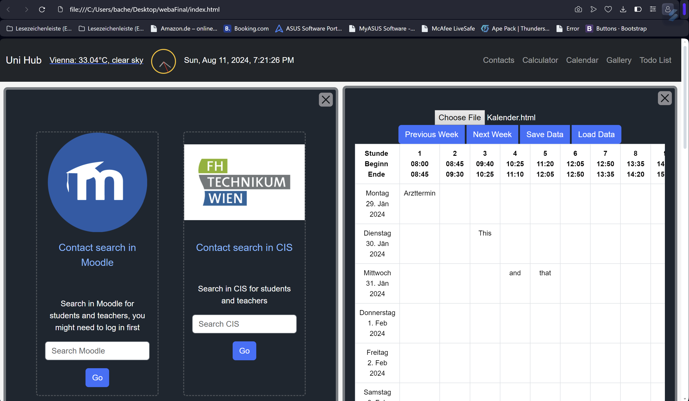

# Student Dashboard

## Overview

This project is a Student Dashboard, developed as a collaborative university project. It showcases our abilities to create a fully functional web application from scratch using a variety of web technologies. The dashboard is designed to manage and display student-related information in a user-friendly interface while taking special to conform to most, if not all, W3C standards for accessibility.

## Features

- **Responsive Design:** Built with HTML and Bootstrap to ensure the dashboard is fully responsive across different devices.
- **Dynamic Content:** Utilizes JavaScript and jQuery to create a dynamic and interactive user experience.
- **Data Management:** Data is saved and retrieved from a local server, with JSON files used to structure and store the data.
- **Server-Side Scripting:** PHP is used for backend processes, including data handling and server communication.

## Technologies Used

- **HTML5:** For the basic structure and content of the web pages.
- **CSS3 & Bootstrap:** To style the website and ensure a responsive design.
- **JavaScript & jQuery:** For dynamic content and client-side interactivity.
- **PHP:** Server-side scripting to handle data and communicate with the local server.
- **JSON:** To format and manage data storage and retrieval.

- 

